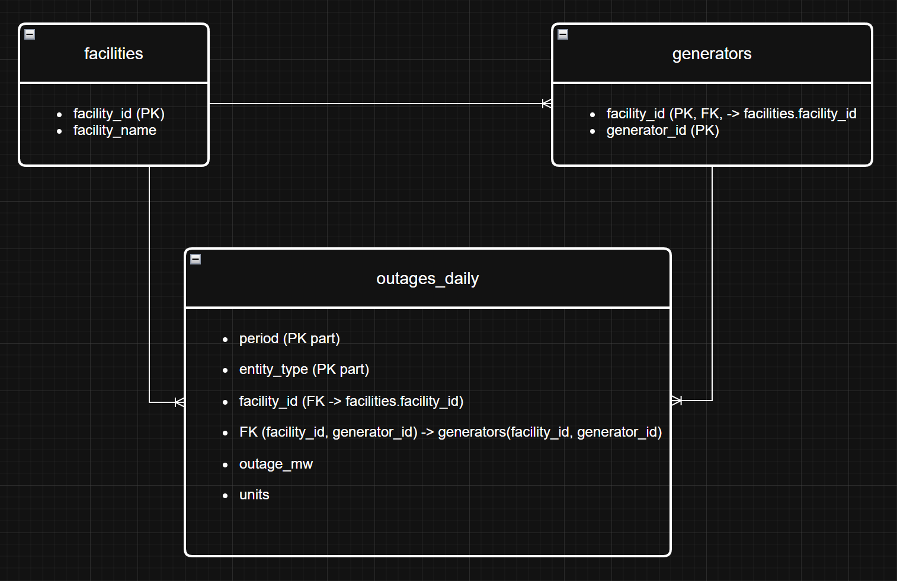

# Arkham - EIA Nuclear Outages (Challenge)

This project builds a data pipeline that extracts Nuclear Outages data from EIA Open Data API, stores it as Parquet,
exposes the data through a REST API, and provides a simple WEB UI to preview and filter the data

**Datasets used (EIA v2)**
- Nuclear plant generator outages
    - Facility level nuclear outages
    - Generator level nuclear outages
    - US (national) nuclear outages

# API documentation (https://www.eia.gov/opendata/):

---

## Contents
- [Quick Start]
- [API Key Setup]
- [Connector (Part 1)]
- [Data Model + ER Diagram (Part 2)]
- [API Service (Part 3)]
- [Web UI (Part 4)]
- [Example Requests / Results]
- [Assumptions / Notes]

---

## Quick Start

### 1) Create and activate a virtual environment

**Windows (PowerShell)**
```powershell
py -m venv .venv
.\.venv\Scripts\Activate.ps1
```

**Mac/Linux**
```bash
python3 -m venv .venv
source .venv/bin/activate
```

### 2) Install dependencies
```bash
pip install -r requirements.txt
```

### 3) Set your EIA API key (see below)

### 4) Run the connector (dowloads and stores Parquet)
Can take several minutes due to the rows quantity
```bash
python connector/fetch_outages.py
```

### 5) Run the API
```bash
uvicorn api.main:app --reload
```
Open Swagger docs:
- http://127.0.0.1:8000/docs

### 6) Run the UI (Streamlit)
```bash
streamlit run "ui/code ui/app.py"
```

# API Key Setup
Create a file named .env in the project root:
```env
EIA_API_KEY=YOUR_API_KEY_HERE
```
**EIA_API_KEY for trying = NYXbhk1L5FzsPNuFSYR1ilgmrfZ9W6IdBl8omch4**

# Connector (Part 1)
The connector:
- Authenticates using API key from environment variables (EIA_API_KEY)
- Extracts data using pagination (offset/lenght)
- Handles network errors with a simply retry
- Validates required fields (skips invalid rows)
- Writes results to Parquet in data/

Run it:
```bash
python connector/fetch_outages.py
```
Output files:
- data/facility.parquet
- data/generator.parquet
- data/us.parquet

# Data Model + ER Diagram (Part 2)
I modeled the data with **three tables** to keep relationship explicit and avoid duplication across datasets:

- **facilities**: unique nuclear facilities (dimension table)
- **generators**: generators belonging to a facility (dimension table, composite key)
- **outages_daily**: daily outage values (fact table) at three levels: `us`, `facility`, and `generator`

### ER Diagram


### Keys and Relationships
- `facilities.facility_id` is the primary key for facilities.
- `generators` uses a composite primary key: `(facility_id, generator_id)`.
- `outages_daily` references:
  - `facility_id -> facilities.facility_id`
  - `(facility_id, generator_id) -> generators(facility_id, generator_id)` when `entity_type = "generator"`
- For `entity_type = "us"`, both `facility_id` and `generator_id` are **NULL**.

This model supports real questions such as:
- “Top facilities by outage (MW) in a given date range”
- “Total US outage over time”
- “Outage distribution by generator within a facility”
# API Service (Part 3)
FastAPI provides two endpoints:

POST /refresh

Triggers data extraction and Parquet storage (connector).
Query params:
- dataset: facility | generator | us

Example:
```bash
curl -X POST "http://127.0.0.1:8000/refresh?dataset=us"
```
GET /data

Returns stored data with filtering and pagination.
Query params:
- dataset: facility | generator | us
- limit (default 100)
- offset (default 0)
- optional filters: start_date, end_date, facility, generator

Example:
```bash
curl "http://127.0.0.1:8000/data?dataset=facility&limit=20&offset=0"
```

# Web UI (Part 4)
Streamlit UI consumes:
- GET /data to display table with filters
- POST /refresh via a button to refresh data

It includes:
- dataset selector
- limit / offset
- data filters
- facility / generator filters (when applicable)
- loading, empty and error states

Run:
```bash
streamlit run "ui/code ui/app.py"
```

# Example Request / Results
Get latest facility outages (first page)
```bash
curl "http://127.0.0.1:8000/data?dataset=facility&limit=10&offset=0"
```

Filter by data range
```bash
curl "http://127.0.0.1:8000/data?dataset=us&start_date=2026-03-01&end_date=2026-03-18&limit=30&offset=0"
```

Refresh US dataset (fastest)
```bash
curl -X POST "http://127.0.0.1:8000/refresh?dataset=us"
```

# Assumptions / Notes
- The connector downloads the full dataset using pagination. This can take time for large datasets (facility/generator).
For faster iteration during development, it can be limited by date using EIA API parameters (start/end) as an improvement.
- Storage uses Parquet locally for simplicity and portability.
- /refresh runs synchronously (blocking). In production, this would be moved to a background job/queue.
- Error handling is implemented (invalid credentials, network retry, and basic field validation).
- .env, .venv/ , and data/ are excluded from version control